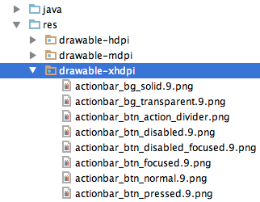

# SelectorGenerator for Android

This Android Studio plugin automatically generates drawable selectors from appropriately named Android resources.

## How to install it:

 - in Android Studio: go to `Preferences→Plugins→Browse repositories` and search for `SelectorGenerator` _or_
 - [download it](http://plugins.jetbrains.com/plugin/7298) and install via `Preferences→Plugins→Install plugin from disk`

## How to use it:

Create images following naming conventions for different states of image and their combinations and put them into standard folders:

| File name infix 	|File name short | Drawable state 		    |
| ------------------| ---------------| ---------------------    |
| _normal 		   	| \_n_ / _n.      | (default state)          |
| _pressed         	| \_p_ / _p.      | state_pressed			|
| _focused         	| \_f_ / _f.      | state_focused			|
| _disabled        	| \_d_ / _d.      | state_enabled (false)    |
| _checked		   	| \_c_ / _c.      | state_checked   		    |
| _selected		   	| \_s_ / _s.      | state_selected  		    |
| _hovered         	| \_h_ / _h.      | state_hovered   	   	    |
| _checkable	   	| \_k_ / _k.      | state_checkable 		    |
| _activated	   	| \_a_ / _a.      | state_activated 		    |
| _windowfocused   	| \_w_ / _w.      | state_window_focused 	|

So for example for button "some_button" there can be created selector from images for normal, pressed, checked and disabled combinations:

| File name              |
|------------------------|
| ic_some_button_n.png   |
| ic_some_button_p.png   |
| ic_some_button_d.png   |
| ic_some_button_c.png   |
| ic_some_button_c_d.png |
| ic_some_button_c_p.png |

1) Right-click folder with your resources e.g 'drawable-xhdpi'

 

2) Select 'Generate Android Selectors RegEx'

 

3) All selectors _automagically_ appear in the 'drawable' folder!

 

## Future development

Create UI for configuring user RegExps for image state detection.

## Cooperation

_Pull requests are welcomed!_

## History of the plugin

Plugin was branched from original "android selector chapek" after couple of weeks of waiting for response on my pull request.

## Why 'Chapek'?

[Karel Čapek](http://en.wikipedia.org/wiki/Karel_%C4%8Capek) was a famous Czech writer, inventor of the word 'robot'. The word comes from Czech word 'robota', which means 'hard manual labor'. As with Čapek's robots, this plugin will remove your unnecessary manual labor. 

See [**our other Czech personalities**](http://inmite.github.io) who help with [#AndroidDev](https://plus.google.com/s/%23AndroidDev).
